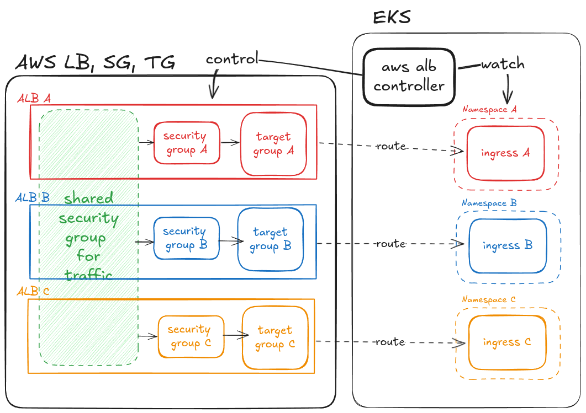

# Introduction
live용도의 인프라를 terraform으로 구축한 코드입니다.

---
# Architecture


- 사용 리소스: `EKS`, `S3`, `AMP`, `ALB`
- vpc는 live vpc를 생성하여 사용했습니다.
- 리소스 간 권한 설정은 `role.tf`를 참고해주세요.
- `sso` 사용자별 `k8s`권한은 `user.tf`를 참고해주세요.

---

# 실행 방법
- **`kubectl`과 `k9s`가 설치되어 있어야 합니다.**
## 리포지토리 클론
```
git clone https://github.com/cdkkim/de-mlops.git
cd infra/live
```

## AWS SSO 설치
- `awscli` 최신버전을 설치해주세요. 최신 버전이 `aws sso configure`가 더 쉽습니다.
### linux
```bash
sudo apt remove awscli
curl "https://awscli.amazonaws.com/awscli-exe-linux-x86_64.zip" -o "awscliv2.zip"
unzip awscliv2.zip
sudo ./aws/install
```
### mac
```bash
curl "https://awscli.amazonaws.com/AWSCLIV2.pkg" -o "AWSCLIV2.pkg"
sudo installer -pkg AWSCLIV2.pkg -target /
```
### window
```bash
Invoke-WebRequest "https://awscli.amazonaws.com/AWSCLIV2.msi" -OutFile "AWSCLIV2.msi"
Start-Process msiexec.exe -ArgumentList '/i AWSCLIV2.msi /quiet' -Wait
```

## AWS SSO 설정
```bash
aws configure sso # access, secret key 입력, profile 명을 꼭 설정해주세요
# SSO session name (Recommended): middlek
# SSO start URL [None]: https://...
# SSO region [None]: ap-northeast-2
# SSO registration scopes [sso:account:access]: # enter
# Default client Region [ap-northeast-2]: # enter
# CLI default output format (json if not specified) [None]: #enter
# Profile name [AdministratorAccess-456330605094]: middlek
# To use this profile, specify the profile name using --profile, as shown:
aws sso login --profile <프로필명>
```

## 개인 환경 변수 수정
- `variable.tf` 수정
- 프로필 명은 `aws configure sso`에서 입력한 값
```hcl
variable "region" {
  description = "AWS region"
  type        = string
  default     = "ap-northeast-2"
}

variable "profile" {
  description = "AWS SSO profile"
  type        = string
  default     = "프로필명"
}
```

## aws 인프라 적용
### Prerequisite
#### [SSO concept](#sso-permission-concept)
#### [EKS user authorization concept](#eks-user-auth-concept)
#### Check permission
- **당신의 `sso role`이 적절한지 확인하세요.**
- 아래 명령어를 실행한 결과물을 확인하세요.
```bash
aws sts get-caller-identity --profile <프로필명>
# arn:aws:iam::... 
```
- `variables.tf`파일의 `sso_admin_role_arn`과 위 명령어의 결과가 동일한 `role`인지 확인하세요.
```
# variable.tf
variable "sso_admin_role_arn" {
 	description = "SSO admin role ARN"
 	type = string
 	default = "arn:aws:iam::..." # 이 값과 같은지 확인
}
```
- **동일하지 않다면 잘못된 `sso role`로 로그인한 것입니다.**
- 적절한 `role`로 로그인하거나, 관리자에게 권한을 요청하세요.
### 리소스 업로드
```bash
terraform init
terraform validate # 문법상 오류가 없는지 확인
AWS_PROFILE=<프로필명> terraform apply
```
- 약 15분 경과 후 AWS 인프라 반영 완료
- 에러 발생시, 한번 더 `AWS_PROFILE=<프로필명> terraform apply` 명령어 실행
## connection
### [ALB Concept](#alb-generation-concept)
### Check all ALB is ready 
- 생성된 `application load balancer` 확인
```bash
aws elbv2 describe-load-balancers \
  --query "LoadBalancers[].DNSName" \
  --output text \
  --profile <프로필명> | tr '\t' '\n'
# prod-alb-123456.ap-northeast-2.elb.amazonaws.com
# staging-alb-789012.ap-northeast-2.elb.amazonaws.com
# dev-alb-345678.ap-northeast-2.elb.amazonaws.com
```
- `http://{Load_balancer_domain_retrieved_using_the_command_above}` **브라우저 주소창**에 입력
- 브라우저 `url`마다 아래 페이지 각각이 노출되면 모든 리소스가 로딩이 완료된 것입니다.

| page    | ID    | PW       | name space   | 비고                              |
| ------- | ----- | -------- | ------------ | ------------------------------- |
| Nginx   | -     | -        | `default`    | 브라우저에 `Welcome to Nginx` 텍스트 표시 |
| ArgoCD  | admin | password | `argocd`     | 브라우저에 ArgoCD 로그인창 표시            |
| Grafana | admin | admin123 | `monitoring` | 브라우저에 Grafana 로그인창 표시           |

## 리소스 정리
- 아래 명령어를 실행시키면 **모든 리소스가 제거됩니다. 중요 파일은 백업해주세요.**
### 1. ALB 리소스 제거
```bash
AWS_PROFILE=<프로필명> terraform destroy \
	-target kubectl_manifest.main_ingress \
	-target kubectl_manifest.argo_ingress \
	-target kubectl_manifest.grafana_ingress
```
- `ingress`부터 지우지 않으면, `alb-controller`가 우선적으로 지워지기 때문에, alb관련 리소스 drift가 발생합니다.
- **반드시 `ingress`를 지우고 aws 콘솔에서 alb가 모두 지워졌는지 확인해주세요.**
### 2. 모든 리소스 제거
```bash
AWS_PROFILE=<프로필명> terraform destroy
```

---
# 참고
## IRSA concept

- **IRSA (IAM Roles for Service Accounts)** 는 Kubernetes의 Service Account에 AWS IAM Role을 매핑하여, 파드 단위로 AWS 리소스 권한을 제어할 수 있는 방식입니다. 

## SSO permission concept

- **AWS SSO Permission 구조**는 조직 내 사용자/그룹별로 role 기반의 AWS 리소스 접근 권한을 할당하고 관리합니다.

## EKS user auth concept

- **EKS 사용자 인증**은 AWS Auth ConfigMap과 IAM 엔터티를 활용하여 Kubernetes 내 사용자 접근 권한을 관리하는 방법을 설명합니다.

## ALB generation concept

- **EKS에서 ALB 생성 구조**는 Kubernetes Ingress 리소스 기반으로 AWS Load Balancer Controller를 활용해 ALB가 자동 생성되는 과정을 설명합니다.